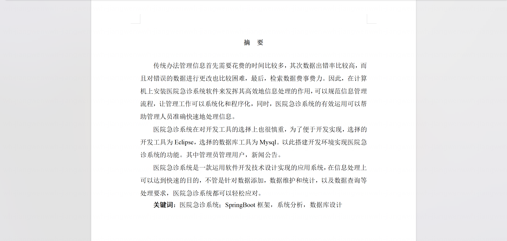
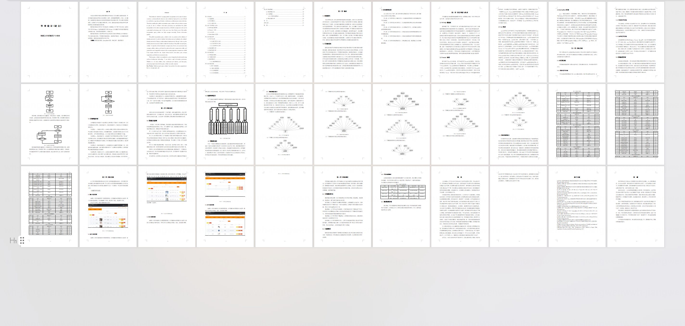
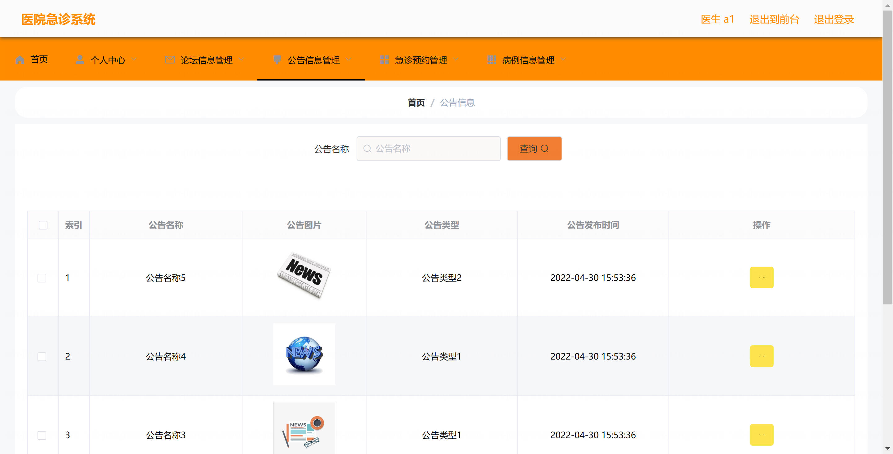
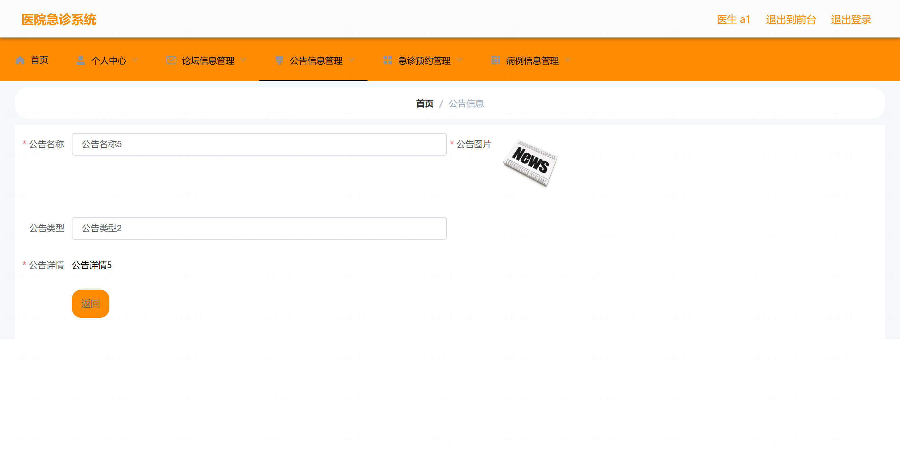
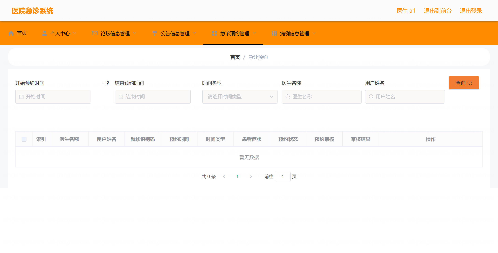
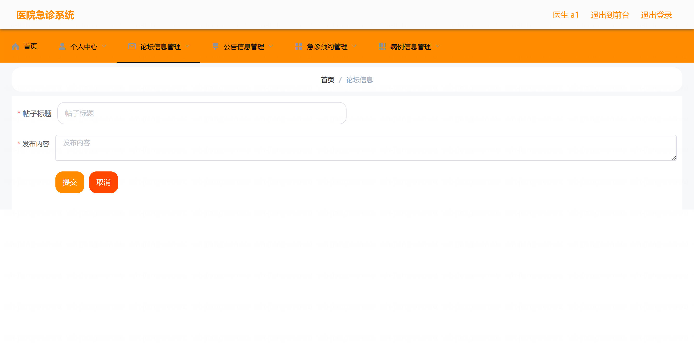
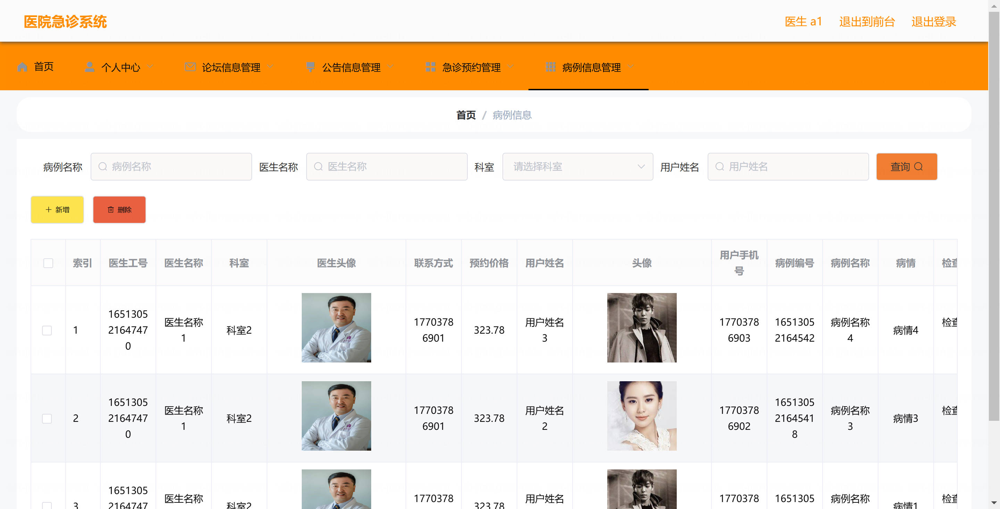
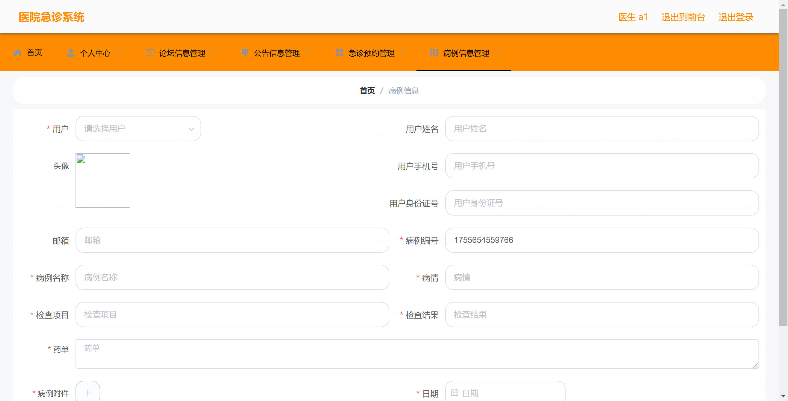
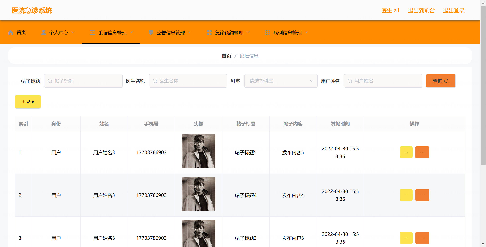
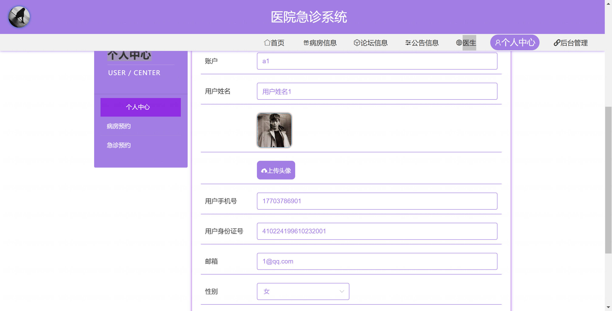

<h1 align="center">基于SpringBoot+Vue的医院急诊管理系统【带论文】</h1>

- <b>完整代码获取地址：从戎源码网 ([https://armycodes.com/](https://armycodes.com/))</b>
- <b>技术探讨、资料分享，请加QQ群：692619798</b>
- <b>作者微信：19941326836  QQ：3645296857</b>
- <b>承接计算机毕业设计、Java毕业设计、Python毕业设计、深度学习、机器学习</b>
- <b>选题+开题报告+任务书+程序定制+安装调试+论文+答辩ppt 一条龙服务</b>
- <b>所有选题地址 ([https://github.com/Descartes007/allProject](https://github.com/Descartes007/allProject)) </b>

## 一、项目介绍

基于SpringBoot+Vue的医院急诊管理系统，系统角色包括：超级管理员、用户、医生，主要功能如下
### 管理员：
- 基本操作：登录、修改密码、获取/修改个人信息
- 系统与用户管理：管理用户账号与角色权限、分配科室
- 系统配置：科室与职位管理
- 统计报表：就诊统计、科室负荷、药品使用、财务报表导出与监控
- 通知管理：发布/删除公告、查看通知发送记录
### 医生（急诊医生）：
- 基本操作：登录、修改密码、获取/修改个人信息
- 接诊管理：患者接诊/分诊、病历创建与编辑、病程记录与签名
- 处置开立：处方开立、检查/检验/影像申请、抢救记录与抢救单管理
- 住院/转科：床位申请、转科记录、出院小结
### 患者/家属（门户/查询端）：
- 基本操作：登记/查看个人信息
- 就诊相关：预约挂号、查询就诊记录、查看检验/检查报告、缴费查询与费用明细

## 二、项目技术

- 编程语言：Java
- 项目架构：B/S 架构（前后端分离）
- 前端技术：Vue.js、Vue Router、Vuex、Element UI、Axios、Webpack/CLI（Node/npm）
- 后端技术：Spring Boot、Spring MVC、MyBatis（或 MyBatis-Plus）/Spring Data JPA、Lombok、Swagger（API 文档）、MySQL

## 三、运行环境

- JDK版本：1.8及以上都可以
- 操作系统：Windows7/10、MacOS
- 开发工具：IDEA、Ecplise、MyEclipse都可以

## 四、数据库配置文件

- npm版本：6.14.13及以上都可以
- Redis版本：3.2.100及以上都可以
- 文件名：application.yml
- 编码类型：utf8

## 论文截图

## 系统截图

